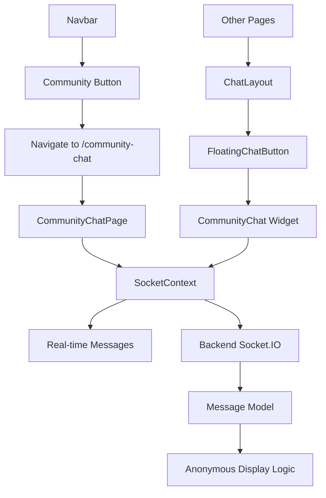

# Anonymous Community Chat Enhancement Design

## Overview

This design document outlines the technical implementation for enhancing the existing community chat system to provide complete anonymity and a full-page chat experience. The solution builds upon the existing Socket.IO infrastructure while adding new components and modifying existing ones.

## Architecture

### High-Level Architecture

```
Frontend Components:
├── SocketContext (existing - enhanced)
├── Navbar (existing - modified)
├── CommunityChat (existing - enhanced)
├── FloatingChatButton (existing - maintained)
├── ChatLayout (existing - enhanced)
└── CommunityChatPage (new - full-page view)

Backend Services:
├── Socket.IO Server (existing - enhanced)
├── Message API (existing - enhanced for anonymity)
├── Authentication Middleware (existing - maintained)
└── Message Model (existing - enhanced)

Routing:
├── /community-chat (new route for full-page)
├── Widget integration (existing routes)
└── Navigation state management
```

### Component Relationships



## Components and Interfaces

### 1. Enhanced SocketContext

**Purpose:** Manage Socket.IO connection and provide anonymous message handling

**Key Changes:**
- Remove user identification from message display
- Maintain user tracking internally for moderation
- Provide consistent anonymous interface

```typescript
interface AnonymousMessage {
  _id: string;
  content: string;
  username: 'Anonymous'; // Always anonymous
  timestamp: string;
  isAnonymous: true; // Always true
}

interface SocketContextType {
  socket: Socket | null;
  messages: AnonymousMessage[];
  isConnected: boolean;
  sendMessage: (content: string) => void;
  // Remove onlineUsers from public interface
}
```

### 2. Modified Navbar Component

**Purpose:** Provide clean community chat access without user metrics

**Key Changes:**
- Remove online user count display
- Simple navigation to full-page chat
- Clean visual design

```typescript
interface NavbarProps {
  // Remove onlineUsers display
  // Keep simple chat toggle functionality
}
```

### 3. New CommunityChatPage Component

**Purpose:** Full-page chat experience with complete viewport utilization

**Features:**
- Full viewport dimensions
- Enhanced message display
- Better input interface
- Navigation back to main app

```typescript
interface CommunityChatPageProps {
  // No props needed - uses SocketContext
}
```

### 4. Enhanced CommunityChat Widget

**Purpose:** Maintain existing widget functionality with anonymity

**Key Changes:**
- Remove user count display from header
- Ensure anonymous message display
- Maintain existing size and positioning

### 5. Updated ChatLayout

**Purpose:** Manage chat visibility and prevent conflicts

**Key Changes:**
- Detect when on full-page chat route
- Hide floating elements when on full-page
- Maintain state consistency

## Data Models

### Enhanced Message Model (Backend)

```javascript
const messageSchema = new mongoose.Schema({
    content: { 
        type: String, 
        required: true,
        maxlength: 500
    },
    userId: { 
        type: mongoose.Schema.Types.ObjectId, 
        ref: 'register',
        required: true 
        // Kept for moderation but never exposed in UI
    },
    username: { 
        type: String, 
        required: true 
        // Stored but overridden to "Anonymous" in display
    },
    isAnonymous: { 
        type: Boolean, 
        default: true 
        // Always true for community chat
    },
    timestamp: { 
        type: Date, 
        default: Date.now 
    },
    isDeleted: { 
        type: Boolean, 
        default: false 
    }
});
```

### Anonymous Message Display Logic

```javascript
// Backend message transformation for anonymity
const anonymizeMessage = (message) => ({
    _id: message._id,
    content: message.content,
    username: 'Anonymous', // Always anonymous
    timestamp: message.timestamp,
    isAnonymous: true
    // userId excluded from client response
});
```

## Error Handling

### Connection Management
- Graceful handling of Socket.IO disconnections
- Retry logic for failed message sends
- Clear user feedback for connection status

### Message Validation
- Client-side and server-side content validation
- Character limit enforcement (500 chars)
- Spam prevention measures

### Navigation Handling
- Proper route management for full-page chat
- State preservation during navigation
- Fallback for unsupported browsers

## Testing Strategy

### Unit Tests
- SocketContext anonymous message handling
- Message anonymization functions
- Navigation state management
- Component rendering with anonymous data

### Integration Tests
- Full-page chat navigation flow
- Widget and full-page chat consistency
- Real-time message synchronization
- Anonymous message display across interfaces

### End-to-End Tests
- Complete user journey from navbar to full-page chat
- Message sending and receiving anonymously
- Multiple user interaction scenarios
- Cross-browser compatibility

## Implementation Plan

### Phase 1: Backend Anonymization
1. Update message API endpoints to return anonymous data
2. Enhance Socket.IO event handlers for anonymity
3. Modify message transformation logic
4. Test anonymous message flow

### Phase 2: Frontend Core Changes
1. Update SocketContext for anonymous messaging
2. Modify Navbar to remove user counts
3. Enhance existing CommunityChat widget
4. Update ChatLayout for route detection

### Phase 3: Full-Page Chat Implementation
1. Create CommunityChatPage component
2. Add routing for /community-chat
3. Implement full-viewport chat interface
4. Add navigation controls

### Phase 4: Integration and Testing
1. Integrate all components
2. Test widget and full-page consistency
3. Verify anonymous messaging across all interfaces
4. Performance optimization and bug fixes

## Security Considerations

### Data Privacy
- User identification removed from all client-side data
- Maintain audit trail in backend for moderation
- Secure message transmission via Socket.IO

### Authentication
- Maintain existing JWT-based authentication
- Ensure only authenticated users can access chat
- Prevent unauthorized message sending

### Content Moderation
- Preserve user tracking in backend for moderation
- Implement soft delete functionality
- Rate limiting to prevent spam

## Performance Optimization

### Message Loading
- Efficient pagination for message history
- Lazy loading for full-page chat
- Message caching strategies

### Real-time Updates
- Optimized Socket.IO event handling
- Minimal data transfer for anonymity
- Connection pooling for scalability

### UI Responsiveness
- Smooth transitions between chat modes
- Efficient re-rendering for anonymous messages
- Mobile-optimized full-page experience

## Deployment Considerations

### Database Migration
- No schema changes required
- Update existing message display logic
- Backward compatibility maintained

### Frontend Deployment
- New route addition (/community-chat)
- Component updates with backward compatibility
- Progressive enhancement approach

### Monitoring
- Track anonymous message volume
- Monitor full-page chat usage
- Performance metrics for both interfaces