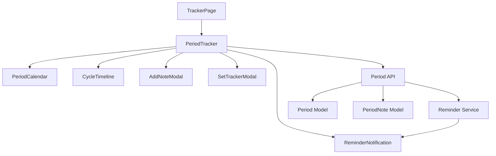

# Period Tracker Design Document

## Overview

This design document outlines the technical implementation for replacing the existing Symptom Tracker with a comprehensive Period Tracker system. The solution includes backend data models, API endpoints, frontend components, and a reminder notification system.

## Architecture

### High-Level Architecture

```
Frontend Components:
├── TrackerPage (renamed/updated)
├── PeriodTracker (new main component)
├── PeriodCalendar (cycle visualization)
├── AddNoteModal (symptom logging)
├── SetTrackerModal (date selection)
├── CycleTimeline (history display)
└── ReminderNotification (alert component)

Backend Services:
├── Period Model (MongoDB schema)
├── PeriodNote Model (symptom notes)
├── Period API Endpoints (CRUD operations)
├── Reminder Service (notification logic)
└── Cycle Calculator (prediction algorithm)

Data Flow:
User → Frontend → API → Database
         ↓
    Reminder Service → Notifications
```

### Component Relationships



## Data Models

### Period Model

```javascript
const periodSchema = new mongoose.Schema({
    userId: {
        type: mongoose.Schema.Types.ObjectId,
        ref: 'register',
        required: true,
        index: true
    },
    startDate: {
        type: Date,
        required: true
    },
    endDate: {
        type: Date,
        default: null
    },
    cycleLength: {
        type: Number,
        default: null // Calculated when next period starts
    },
    predictedNextDate: {
        type: Date,
        required: true
    },
    isActive: {
        type: Boolean,
        default: true // Current cycle
    },
    remindersSent: {
        threeDayBefore: { type: Boolean, default: false },
        onDay: { type: Boolean, default: false }
    }
}, {
    timestamps: true
});

// Index for efficient querying
periodSchema.index({ userId: 1, startDate: -1 });
periodSchema.index({ userId: 1, isActive: 1 });
```

### PeriodNote Model

```javascript
const periodNoteSchema = new mongoose.Schema({
    userId: {
        type: mongoose.Schema.Types.ObjectId,
        ref: 'register',
        required: true,
        index: true
    },
    periodId: {
        type: mongoose.Schema.Types.ObjectId,
        ref: 'Period',
        required: true
    },
    date: {
        type: Date,
        required: true,
        default: Date.now
    },
    symptoms: {
        cramps: {
            type: String,
            enum: ['none', 'mild', 'moderate', 'severe'],
            default: 'none'
        },
        flow: {
            type: String,
            enum: ['spotting', 'light', 'medium', 'heavy'],
            default: 'medium'
        },
        mood: {
            type: String,
            enum: ['happy', 'neutral', 'sad', 'irritable', 'anxious'],
            default: 'neutral'
        },
        pain: {
            type: Number,
            min: 0,
            max: 10,
            default: 0
        }
    },
    medications: [{
        name: String,
        dosage: String,
        time: String
    }],
    customNotes: {
        type: String,
        maxlength: 1000
    }
}, {
    timestamps: true
});

periodNoteSchema.index({ userId: 1, periodId: 1, date: -1 });
```

## Components and Interfaces

### 1. PeriodTracker Component (Main)

**Purpose:** Main container for period tracking functionality

**Props:**
```typescript
interface PeriodTrackerProps {
  // No props - uses auth context
}
```

**State:**
```typescript
interface PeriodTrackerState {
  currentCycle: Period | null;
  pastCycles: Period[];
  notes: PeriodNote[];
  loading: boolean;
  showAddNote: boolean;
  showSetTracker: boolean;
  showResetConfirm: boolean;
  reminders: Reminder[];
}
```

### 2. PeriodCalendar Component

**Purpose:** Visual calendar showing cycle days and predictions

**Features:**
- Current cycle day indicator
- Days until next period
- Color-coded calendar (period days, fertile window, predicted period)
- Interactive date selection

### 3. AddNoteModal Component

**Purpose:** Form for logging period symptoms and notes

**Fields:**
- Cramps intensity (none/mild/moderate/severe)
- Flow level (spotting/light/medium/heavy)
- Mood (happy/neutral/sad/irritable/anxious)
- Pain level (0-10 slider)
- Medications (dynamic list)
- Custom notes (text area)

### 4. SetTrackerModal Component

**Purpose:** Date picker for setting last period start date

**Features:**
- Calendar date picker
- Validation (no future dates)
- Automatic cycle recalculation
- Confirmation message

### 5. CycleTimeline Component

**Purpose:** Display past cycles with expandable notes

**Features:**
- Chronological list of cycles
- Cycle length and dates
- Note count indicator
- Expandable to show all notes
- Average cycle length display

### 6. ReminderNotification Component

**Purpose:** Display period reminders to user

**Types:**
- 3-day advance warning
- On-day reminder
- Dismissible
- Persistent until dismissed

## API Endpoints

### Period Management

```javascript
// Get user's period data
GET /api/period/cycles
Response: {
  currentCycle: Period,
  pastCycles: Period[],
  averageCycleLength: number,
  nextPredictedDate: Date
}

// Start new period cycle
POST /api/period/start
Body: { startDate: Date }
Response: { period: Period, message: string }

// End current period
POST /api/period/end
Body: { endDate: Date }
Response: { period: Period, message: string }

// Update period tracker
PUT /api/period/update/:periodId
Body: { startDate?: Date, endDate?: Date }
Response: { period: Period, message: string }

// Reset tracker (delete all data)
DELETE /api/period/reset
Response: { message: string }
```

### Notes Management

```javascript
// Get notes for a period
GET /api/period/notes/:periodId
Response: { notes: PeriodNote[] }

// Add new note
POST /api/period/notes
Body: {
  periodId: string,
  symptoms: {...},
  medications: [...],
  customNotes: string
}
Response: { note: PeriodNote, message: string }

// Update note
PUT /api/period/notes/:noteId
Body: { symptoms, medications, customNotes }
Response: { note: PeriodNote, message: string }

// Delete note
DELETE /api/period/notes/:noteId
Response: { message: string }
```

### Reminders

```javascript
// Get pending reminders
GET /api/period/reminders
Response: { reminders: Reminder[] }

// Dismiss reminder
POST /api/period/reminders/dismiss
Body: { reminderId: string }
Response: { message: string }
```

## Cycle Calculation Logic

### Default Prediction (First Cycle)
```javascript
function calculateNextPeriod(startDate) {
  const DEFAULT_CYCLE_LENGTH = 30;
  const nextDate = new Date(startDate);
  nextDate.setDate(nextDate.getDate() + DEFAULT_CYCLE_LENGTH);
  return nextDate;
}
```

### Average-Based Prediction (3+ Cycles)
```javascript
function calculateAverageCycle(periods) {
  if (periods.length < 3) {
    return 30; // Default
  }
  
  const cycleLengths = periods
    .filter(p => p.cycleLength)
    .map(p => p.cycleLength);
  
  const average = cycleLengths.reduce((a, b) => a + b, 0) / cycleLengths.length;
  return Math.round(average);
}

function predictNextPeriod(lastPeriod, averageCycleLength) {
  const nextDate = new Date(lastPeriod.startDate);
  nextDate.setDate(nextDate.getDate() + averageCycleLength);
  return nextDate;
}
```

### Reminder Calculation
```javascript
function checkReminders(predictedDate, remindersSent) {
  const today = new Date();
  const daysUntil = Math.ceil((predictedDate - today) / (1000 * 60 * 60 * 24));
  
  const reminders = [];
  
  // 3-day advance warning
  if (daysUntil === 3 && !remindersSent.threeDayBefore) {
    reminders.push({
      type: '3-day',
      message: 'Your period is expected in 3 days',
      date: predictedDate
    });
  }
  
  // On-day reminder
  if (daysUntil === 0 && !remindersSent.onDay) {
    reminders.push({
      type: 'on-day',
      message: 'Your period is expected today',
      date: predictedDate
    });
  }
  
  return reminders;
}
```

## UI/UX Design

### Color Scheme
- **Primary**: Purple (#7C3AED) - consistent with app theme
- **Period Days**: Light red/pink (#FEE2E2)
- **Predicted Period**: Light purple (#EDE9FE)
- **Current Day**: Bold purple border
- **Fertile Window**: Light green (#D1FAE5) - optional

### Icons
- **Main Icon**: Calendar with flower (lucide-react: Calendar + Flower2)
- **Add Note**: Plus circle
- **Set Tracker**: Settings
- **Reset**: RotateCcw
- **Cramps**: Activity
- **Flow**: Droplets
- **Mood**: Smile/Frown
- **Pain**: AlertCircle

### Layout Structure

```
┌─────────────────────────────────────┐
│  Period Tracker Header              │
│  [Calendar Icon] Period Tracker     │
├─────────────────────────────────────┤
│  Current Cycle Info                 │
│  Day 15 of cycle                    │
│  Next period in 15 days             │
├─────────────────────────────────────┤
│  Action Buttons                     │
│  [Add Note] [Set Tracker] [Reset]   │
├─────────────────────────────────────┤
│  Calendar View                      │
│  [Visual calendar with highlights]  │
├─────────────────────────────────────┤
│  Cycle Timeline                     │
│  ┌─ Cycle 1 (Nov 1-28, 28 days)    │
│  │  [3 notes] [Expand ▼]           │
│  └─────────────────────────────────│
│  ┌─ Cycle 2 (Oct 3-30, 27 days)    │
│  │  [5 notes] [Expand ▼]           │
│  └─────────────────────────────────│
└─────────────────────────────────────┘
```

## Error Handling

### Validation
- Start date cannot be in the future
- End date must be after start date
- Cycle length must be between 21-45 days
- Pain level must be 0-10
- Custom notes limited to 1000 characters

### Error Messages
- "Please select a valid date"
- "Period has already been logged for this date"
- "Cannot reset tracker without confirmation"
- "Failed to save note. Please try again."

## Testing Strategy

### Unit Tests
- Cycle calculation functions
- Date validation logic
- Average cycle length calculation
- Reminder trigger conditions

### Integration Tests
- Period CRUD operations
- Note creation and retrieval
- Reminder system functionality
- User authentication for period data

### End-to-End Tests
- Complete period logging flow
- Add and view notes
- Set and reset tracker
- Reminder notifications display

## Performance Optimization

- Index database queries by userId and date
- Cache current cycle data in frontend state
- Lazy load past cycles (pagination)
- Debounce note auto-save
- Optimize calendar rendering for large date ranges

## Security Considerations

- All period endpoints require authentication
- User can only access their own period data
- Input sanitization for custom notes
- Rate limiting on API endpoints
- Secure storage of sensitive health data

## Migration Strategy

1. Create new Period and PeriodNote models
2. Deploy new API endpoints
3. Update frontend components
4. Replace Symptom Tracker references
5. Test with subset of users
6. Full rollout with user notification